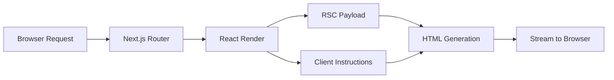

# RSC Rendering Lifecycle

## Key Players

When discussing React Server Components rendering, three key players are involved:

| Entity | Role |
|--------|------|
| Browser (Client) | Requests and renders the UI |
| Next.js (Framework) | Matches routes and coordinates rendering |
| React (Library) | Renders components and produces the RSC payload |

## Initial Loading Sequence

The initial page load follows a multi-step process:

### Step 1: Request Matching

When the browser requests a page, the Next.js App Router matches the requested URL to a server component route.

### Step 2: Server-Side Rendering

Next.js instructs React to render the matched server component. React renders the component tree, converting server components into a special JSON format known as the **RSC payload**.

```typescript
// Example RSC payload structure (simplified)
{
  "type": "div",
  "props": {
    "children": [
      { "type": "h1", "props": { "children": "About page" } }
    ]
  }
}
```

### Step 3: Suspense Handling

If any server component suspends (e.g., during data fetching), React pauses rendering of that subtree and sends a placeholder value instead.

### Step 4: HTML Generation

Next.js takes both the RSC payload and client component instructions to generate HTML on the server.



### Step 5: Streaming to Browser

The HTML streams to the browser immediately, giving a quick non-interactive preview. Simultaneously, the RSC payload streams as React renders each piece of UI.

### Step 6: Client-Side Processing

Once the RSC payload reaches the browser, Next.js processes everything that was streamed. React uses the RSC payload and client component instructions to progressively render the UI.

### Step 7: Hydration

Client components undergo hydration, transforming the application from a static display into an interactive experience.

## Update Sequence (Route Refetch)

When refreshing parts of the application, a different process occurs:

### Step 1: Request

The browser requests a refetch of a specific UI (such as a full route navigation).

### Step 2: Server Processing

Next.js processes the request, matches it to the requested server component, and instructs React to render the component tree.

### Step 3: Streaming Response

Instead of generating new HTML for updates, Next.js progressively streams the RSC payload directly back to the client.

### Step 4: Reconciliation

On receiving the streamed response, Next.js triggers a rerender of the route using the new content. React reconciles (merges) the new rendered output with the existing components on the screen.

```tsx
// Conceptual example of RSC update flow
// The browser sends a request, gets back RSC payload,
// and React merges it while preserving client state

// Client state (e.g., input text, scroll position) is preserved
// during RSC updates because React reconciles at the component level
```

Because the RSC payload uses a special JSON format instead of HTML, React can update everything while keeping important UI states intact (scroll position, input focus, expanded accordions).

## Server Rendering Strategies

After understanding the RSC lifecycle, Next.js offers three server rendering strategies:

| Strategy | Description |
|----------|-------------|
| Static Rendering | HTML generated at build time |
| Dynamic Rendering | HTML generated per request |
| Streaming | Progressive UI rendering from the server |

Each strategy determines how and when components are rendered on the server before reaching the client.
